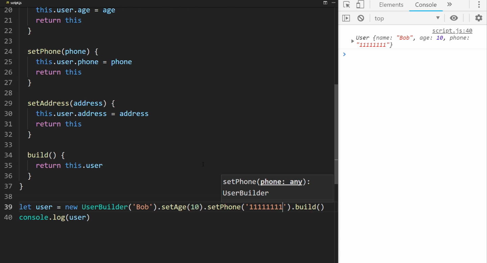

# Frequent Design Patterns

## 1. Singleton

[출처 : 린생님 티스토리 ](https://linsaeng.tistory.com/9?category=753322)

> 어플 실행 시작 후, 한 번만 메모리 할당 및 인스턴스화 하여 사용하는 것.

### 1). 왜 써?

1. __메모리 사용, 할당 오버헤드 줄이기__ - 한 번 할당, 인스턴스화 한 후 실행 내내 그것만
2. 특별히 유용한 케이스 - __네트워킹 작업을 해주는 객체__ - 네트워킹 작업은 하나의 세션을 유지하면서, 해당 세션에 이상이 생기면 노티피케이션을 해주어 핸들링해야 합니다.

### 2). 구현

```swift
class SingleTon {
    private static let sharedInstance = SingleTon()
   
    private init() { }
}
```

```swift
class SingleTon {

    static let sharedInstance = SingleTon()

    private lazy var name : String = ""
    private lazy var age : Int = ""
    
    private init() {} // MARK:- Not Accessible outside the definition area
    
    func setProperty(){
        self.name = "Seokhee"
        self.age = 28
    }

    func getProperty() -> (String, Int){
        return (self.name, self.age)
    }

}
//MARK:- Test !!

let firstInstance = SingleTon.sharedInstance
let secondInstance = SingleTon.sharedInstance
firstInstance.setProperty()   
print(secondInstance.getProperty())
   
   // -> Seokhee 28 !! Using shared instance!!

```

## 2. 옵저버 패턴 👀

```swift
//옵저버들이 어떻게 업데이트할 지, 프로토콜, 새로운 속성값을 받는 업데이트 메서드 정의
protocol Observer {
 func update(_ notifyValue: Int) 
}

class Subject {

 private var observers: [Observer] = [Observer]() // 옵저버들은 피-관찰 객체의 옵저버 리스트에 등록
 private var value: Int = Int()

 //해당 객체에 대하여 관찰하고자 하는 속성 프로퍼티의 -> 세터에, notify()를 호출해준다.
 var number: Int {
     set {
         value = number
         notify()
     }
     get {
         return value 
     }
 }

 //옵저버를 객체의 옵저버 리스트에 더해주는 함수
 func attachObserver(_ observer: Observer) {
     observers.append(observer)
 }
 
 //옵저버 알림 - 속성에 새로운 값이 셋 되었을 때, 옵저버로서 프로토콜을 채택한 관찰자 님들의 update함수를 바뀐 속성과 함께 호출해주는 -> 노티파이!!
 func notify() {
     for observer in observers {
         observer.update(number)
     }
 }
}
```
### 왜 써? 
   1. protocol 준수
   2. 옵저버 등록 

~만 하시면 다른 객체의 변화에 실시간 반응 가능 - 매우 간편.
<br>

* Subject 객체에 대한 observers 어레이 생성
* 관찰하고자 하는 속성에 setter에 대하여, notify()  함수 실행
* 옵저빙 객체들은 Observer프로토콜 준수하여, update함수를 구현해아 햠
* 세터에 셋이 되면, notify함수 실행하고, 그때 옵저버스 어레이에 있는 객체들 이터레이션 하면서, 새로운 number에 대하여, 자신을 업데이트
> 결론 : 한 객체의 옵저버 프로토콜을 준수하여, 등록된 객체들의 업데이트 메서드가 불러지면서, 피옵저빙 객체의 특정 속성의 변화가 반영이 됨.

## 3. 빌더 패턴 👷🏻

[최애 유투브 - Web Dev Simplified - Builder Pattern 참고](https://www.youtube.com/watch?v=M7Xi1yO_s8E&t=328s)



```javascript
class User {
    constructor(name){
        this.name = name
    }
    // age, phone is optional
}
//MARK:- Responsible for convenient instantiation
class UserBuilder {
    constructor(name){
        this.user.name = name
    }
    setAge(){
        this.user.age = age
        return this // ⭐️
    }
    setPhone(){
        this.user.phone = phone
        return this // ⭐️
    }
    build(){
        return this.user
    }
}
// ⭐️ ⭐️ => chaining method => easy instantiation
let user = new UserBuilder('Bob').setAge(10).setPhone('1111111').build()
console.log(user)
```

### 왜 써 ?
1. nil이 될 수도 있는 선택적인 속성들을 많이 가진 객체를 인스턴스화 할 때,
2. __편리한 체이닝을 통해__ 한 줄로, 옵셔널한 값 중에 지정할 속성만 명시하여 인스턴스화 가능
3. __clean code : 가독성__ 상승
4. __+) 더 있는 데 아직은 와닿지 않음 !! 추가할 것__

## Factory Pattern 🏭 ꠷

```swift
// protocol
protocol Factoryable {
    func makeProduct() -> String
}
// adopted
struct Pen: Factoryable {
    func makeProduct() -> String {
        return "펜"
    }
}

struct Bag: Factoryable {
    func makeProduct() -> String {
        return "가방"
    }
}
//MARK:- Factory 생산 라인 작업 - 정확히 어떤 타입의 제품을 만드는 지는 모름

func outputView(_ product: Factoryable) {
    print("공장에서 \(product.makeProduct())을 만들었습니다.")
} 

//
func main() {
    let pen = Pen()
    let bag = Bag()

    outputView(pen)    // 공장에서 펜을 만들었습니다.
    outputView(bag)    // 공장에서 가방을 만들었습니다.
}

```

### 왜 써?
<br>

1. 파라미터로 프로토콜인 Factoryable로서 객체들을 받아서 실행 가능 : (_ product: Factoryable)<br>
 
    ```swift
    func outputView(_ product: Factoryable) {
    print("공장에서 \(product.makeProduct())을 만들었습니다.")
    } 
    ```
<br>

2. __view는 이 작업을 수행할 대상 객체들이 어떤 타입 출신인지 미리 몰라도 된다.__

