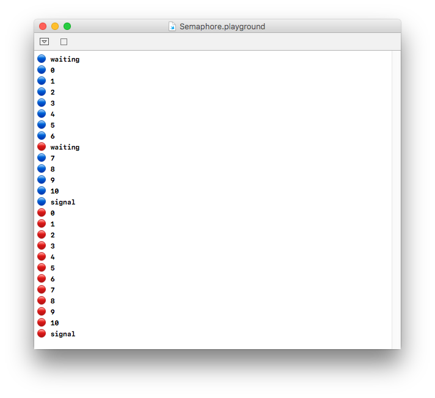
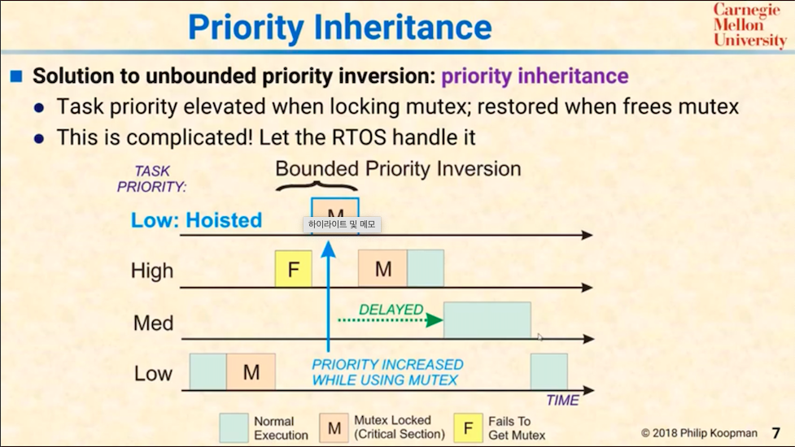
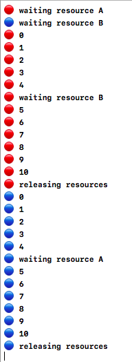
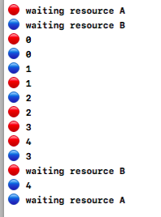

# 동시성 - 자원 동기화

> " 더 우선 진행되어야 하는 작업은 higher priority queue에 스케쥴링하고, 임계구역 이슈는, 세마포(value : 1 ) 나 뮤텍스를 설치하자 "<br> 
> " For Thread Safety during Pararell Processing "


## 1. Semaphore-없는 멀티스레딩 예시로 기초 다지기

```swift
import Foundation
import PlaygroundSupport

//MARK:- Semaphore-less multi-threading practice
let higherPriority = DispatchQueue.global(qos: .userInitiated)
let lowerPriority = DispatchQueue.global(qos: .utility)
func asyncPrint( queue : DispatchQueue, symbol : String ) {
    //
    queue.async {
        for i in 0...10 {
            print(symbol, i)
        }
    }
    //
}

asyncPrint(queue: higherPriority, symbol: "🔴")
asyncPrint(queue: lowerPriority, symbol: "🔵")
PlaygroundPage.current.needsIndefiniteExecution = true
```

```swift
[ output ] : 
🔵 0 // 
🔴 0
🔴 1
🔴 2
🔴 3
🔴 4
🔴 5
🔴 6
🔴 7
🔴 8
🔴 9
🔴 10
🔵 1
🔵 2
🔵 3
🔵 4
🔵 5
🔵 6
🔵 7
🔵 8
🔵 9
🔵 10
```
* 해설 : 세마포가 없어, higherPriorityQueue에 Dispatch한 것과, lowerPriority에 Dispatch한 블록이 불규칙하게 스위칭하면서 작업된다. 


## 2. 세마포 미션 - 마시면서🍻 배우는 세마포
> 동그라미 + 숫자를 10개 프린트하는 구간에 대하여, 동시 실행되지 않도록 세마포어를 동원하라 !!  🛂

```swift
let semaphore = DispatchSemaphore(value: 1)

func asyncPrint( queue : DispatchQueue, symbol : String ) {
    //
    print("\(symbol) waiting ...")
    semaphore.wait() 
    // ✋🏻 < wait > - 세마포야 카운트를 보고 0이상이면, 이 시그널을 보낸 스레드에
    // 청신호를 켜고 카운트를 0으로 만든다 
    // 만약 0이면, 이 시그널을 보낸 스레드를 FIFO큐 뒤로 보내버려, 
    // 실행되지 않게 한다.
    queue.async {
        for i in 0...10 {
            print(symbol, i)
        }

        print("\(symbol) signaling ...")
        semaphore.signal()
        // < 🚨 signal > - semaphore야 지금 큐에서 기다리고 있는 작업이 있으면, 
        // 그 스레드에게 청신호를 켜주고, 그럼 카운트 업데이트 할 필요 없음 
        // - 없다면? 카운트를 다시 1로 높여
    }
}
//
asyncPrint(queue: higherPriority, symbol: "🔴")
asyncPrint(queue: lowerPriority, symbol: "🔵")
PlaygroundPage.current.needsIndefiniteExecution = true
```

```swift
🔴 waiting ... // count -> 0
🔵 waiting ... // send back to the waiting queue => semaphore sends 
// it back to the FIFO queue : "Go away Anna~"
🔴 0
🔴 1
🔴 2
🔴 3
🔴 4
🔴 5
🔴 6
🔴 7
🔴 8
🔴 9
🔴 10
🔴 signaling ... // higherPriority 스레드가 시그널을 줄 때까지, 새로운 스레드 진입 불가
🔵 0
🔵 1
🔵 2
🔵 3
🔵 4
🔵 5
🔵 6
🔵 7
🔵 8
🔵 9
🔵 10
🔵 signaling ...
```

* 코드 블록 중 특정 구간에, (동시성 문제에서는 크리티컬 섹션일 것.) 두 개의 스레드가 동시에 진입하는 이슈를 해결
  

### But, 세마포어 이용시 문제점?
[ carnegie mellon OS course 참고 ](https://www.notion.so/fundamentaldeveloper/4340756b0e5a42889f554f94eaccc4f7#e8595ef1b50e49788891ee7a6536ea3b)<br>

1. Priority Inversion
2. Thread Starvation
 
    

    ### 1. 더 높은 우선순위를 가진 큐에 asynchronously dispatch했던 작업이, 나중에 실행될 수도 있다.
    ### 2. 만약 도중에 더 많은 중간 단계 우선 순위 큐들이 끼어 있다면, high priority queue 작업이 높은 우선순위에도 불구하고, CPU타임을 많이 받지 못함 => Don't make sense : higher priority queue dispatched job, but not much cpu time.

<br>

## 3. 세마포(뮤텍스 포함) 비합리적인 이슈 해결하는 방법 - 우선 순위 전도 & 고 우선 순위 작업 Starvation Issue - "Hoist the Low Priority Task to Higher or Eqaul Priority than the job that requested mutex but failed."

1. Don't use SEMAPHORE sync. method if,
    1. __Many Jobs Vary in priority.__ Huge Variance in jobs' priority.
       1. Because, starving high priority queue job doesn't make sense.
2. __Or, < Priority Inhertance - for inversiion >__ - 실제로 리눅스 같은 OS는 이것을 통해, High Priority Queue jobs들이 Starving되는 것을 방지한다.<br>
 
   
   <br>

   1. L이 뮤텍스의 락 획득, 임계 구역 진입
   2. H가 뮤텍스의 토큰을 획득하려 하나 실패
      ### 1). 이때, Low Prior. Task를 hoist(격상 시킴) - 토큰을 획득하려한, high priority task보다, 더 높거나 같은 우선 순위로 격상. => Low Priority Task가 뮤텍스 릴리즈 => "Medium"이 아닌 "High"가 진입.
      ### 2). Priority Inheritance가 없다면, H가 mutex 토큰 획득 실패 후 어떠한 조치도 이루어지지 않아, Low Priority 태스크 다음에 수 많은 Medium 우선 순위들이 mutex획득


## Deadlock
> 쓰레드 1은 A라는 임계 구역의 자원에 접근하는 mutex 토큰 획득, 그러나, 이 토큰을 릴리즈하기 위해서는, B라는 자원이 있는 임계구역에 진입하여 release하게 됨.
> 쓰레드 2는 B라는 임계 구역의 자원에 접근하는 mutex 토근을 획득, 그러나, 이 토큰을 릴리즈하기 위해서는, A라는 자원이 있는 임계구역에 진입하여 release하게 됨.
> 고 우선 순위 쓰레드, 저 우선 순위 쓰레드가 서로 들고 있는 임계 구역 입장 토큰으로 인해, 서로 진행을 계속하지 못하게 됨. 두 큐 모두가 블락 당해서 - 락다운 된 상태 <br>
 
1. 릴리즈 타이밍을 잘 잡았을 때,<br>
 


2. 쓰레드 스위칭에서 데드락이 발생하게 되는 상황이 생기게 개발되었을 때,<br>



### 해결책
1. release mutex의 타이밍을 코드에 잘 반영
2. OS에서는 데드락 감지 후, 한 쓰레드를 아예 죽이고, mutex를 릴리즈 시킴 => 나머지 쓰레드만큼은 계속 진행
3. Ostrich Algorithm


## 참고 자료
1. [Five Stars Blog](https://www.fivestars.blog/code/semaphores.html)
2. [Bounded Priority Inversion](https://www.youtube.com/watch?v=z9FRFV2GOVc)