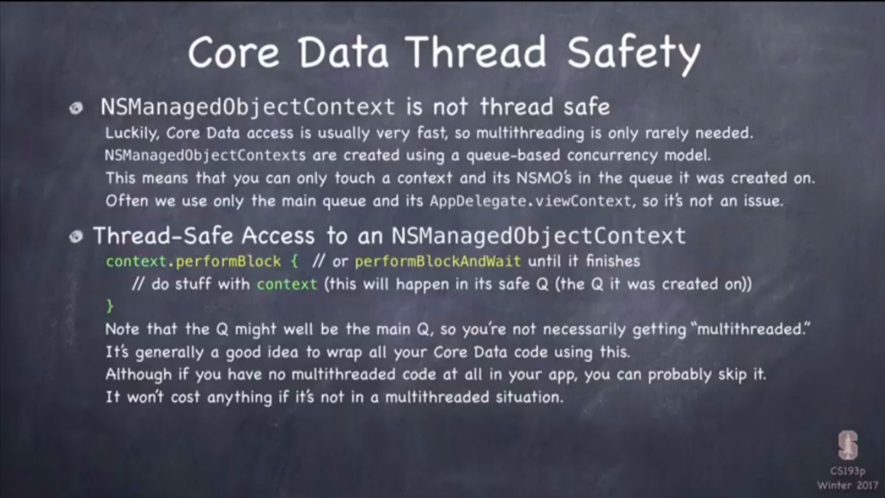
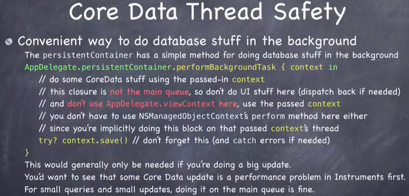

# Loading from & Writing to, a DB, from different threads, "Concurrently" ( ft. iOS Core Data )
<br>
<br>



### 1. Assumptions

> Client 단에서 변화가 발생한 객체들의 변화를 감지하여 DB 파일에 저장하는(또는, DB 파일의 데이터를 읽어오는) **NSManagedObjectContext** 객체에 대하여 :

 1. 해당 Context 객체는 **스레드 안전** 하지 않다.<br>
    * 여러 쓰레드에서 레퍼런스를 가져가 업데이트를 하면 컨텍스트에 객체 데이터 변화 반영의 일관성이 보장되지 않는다.

## 1. 중요 전제 : <br>
> * "Context can only be used on the queue that it was created on."<br>
> = 컨텍스트 객체는 그것의 출신지 큐에서만 사용될 수 있습니다.<br>
> = __현 스레드에서 생성된 컨텍스트__ 객체라면, 다른 스레드로 가져가지 마셈. ✋🏻 🔴 

> * 당신은, 특정 스레드에서 생성한 컨텍스트를 다른 스레드로 Dispatch 해서는 안 됩니다. (라이크 디스패치 글로벌)
> * 또한, 당신이 해당 컨텍스트 객체를 전달하여, 생성한 관리 대상 객체도, 그것이 생성된 스레드에 머물러야 합니다.

### 의문1 : 그럼 멀티스레딩을 어찌하라는 거임? 다른 백그라운드 큐에서 DB 로딩을 오지게 하고 싶으면 어캄? 메인 큐에서 진행하면 유아이가 얼자나. 그래서 난 백그라운드에서 이걸 하고 싶단 말임 ~~~~~ !!! 

### 답1 : 한 디비는 여러 개의 컨텍스트 객체를 가질 수 있음. 디비에 대하여, 많은 컨텍스트 객체들이 동시에 읽기 & 쓰기를 해도 됨. 쓰레드마다 다른 컨텍스트 객체들을 만들고, 타겟 디비를 읽고 쓰셈 !!!
<br>

## 2. Context 스레드 세이프티를 보장하는 메서드
```swift
context.performBlock{ } // ( ) -> Void 
```
* { } 클로저에 있는 작업은, "올바른 큐" 에서 실행된다는 것을 "보장"하는 메서드.
* __Core Data 관련 작업은 모두 컨텍스트.퍼폼블락{ }을 통해 하면, 스레드 안정성이 보장됨 => "방어적 프로그래밍"__ 
* 만약 컨텍스트가 다른 스레드에 가있다면, context.perfromBlock{ }, { }에 정의된 작업을 적합한 큐에서 실행할 것이다.
<br>
<br>

## 3. 백그라운드 큐에 컨텍스트 객체 생성(~하여, 멀티스레딩으로 디비 작업하는 법은? 그럼? )



```swift
AppDelegate.persistentContainer.performBackgoundTask{ context in
    // 
}
```

> 이 메서드가,
> 1. 메인이 아닌 적절한 백그라운드 큐를 찾아서 !
> 2. 그 큐에 컨텍스트 객체를 별도로 생성할 거고 !
> 3. 그 백그라운드 큐에서 그 새로운 컨텍스트를 가지고 { } 클로저 내용을 실행할 것임 !

> QoS 지정도 가능? - 내가 원하는 큐에 ?
> * 그래도 되지만, CoreData 프레임워크가 해당 작업의 QoS를 적절히 산정하는 메커니즘을 이미 잘 가지고 있어서, 굳이 필요 없음.

> 주의점 ?
> * main thread context 객체는 이 안에 언급하지마 ...
> * context.save()를 잊지마 !!

> 결과물은?
> * 만약 백그라운드에 생성된 컨텍스트 객체가, 변화를 DB에 일으킬 경우...
## 여러 스레드에 산재된 다른 스레드의 컨텍스트 객체들로, 다른 컨텍스트 객체가 일으킨 변화를 실시간으로 볼 수 있고 => " 반응할 수도 있음 " <br><br>


# < 결론 >
# 1. DB Loading off the mainQ
```swift
// Loading
AppDelegate.persistentContainer.performBackgoundTask{ context in }
```
# 2. DB Querying & Fetching on the mainQ( ft. thread safety )
```swift
context.performBlock{ } // ( ) -> Void 
```

# < 참고 자료 >
[Stanford CS 193P iPhone Application Development - Lecture 10: Core Data](https://www.youtube.com/watch?v=ssIpdu73p7A&t=4558s)
