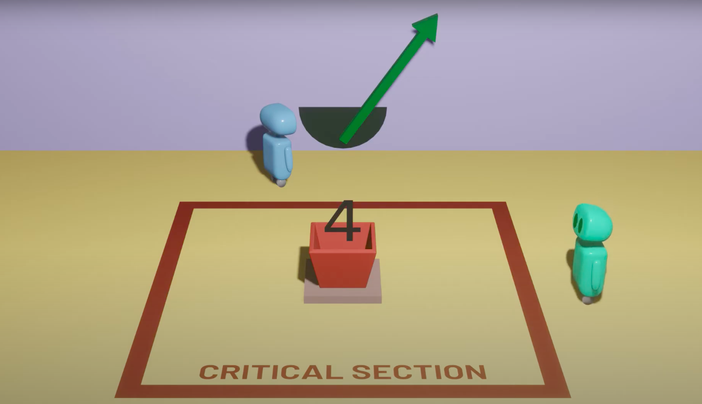

# Learn Job Seeking The Hard Way

### 1.13(수)에 "귀여운 실패"를 통해 배우게 된 것 

1. TCP vs. UDP의 차이?
   
   TCP, UDP는 IP에서 통신을 할 때, 상황에 맞게 채택하는 통신 규약으로, 클라-서버 와 같은, 엔드포인트 컴퓨터끼리 데이터를 주고 받는 것에 대한
   다양한 타입의 계약 사항 중 두 가지라고 볼 수 있다. 

   TCP - __웹, 앱, 메일__ 등의 데이터 통신(비디오 스트리밍, 게임과 같이 고용량 데이터 빠른 전송이 아닌)
   * 전송할 데이터의 무결성( 유실없고, 원본 그대로 전송 )을 보장한다.
   * 무결성을 보장하기 위한, 엔드 포인트 간의 체크 단계가 많다.
     * 예시). 쓰리 웨이 핸드 셰이크 ( 3번 ACK수 !! )
        
        
        
         * SYN(CHRONIZATION)
         * SYN ACK
         * ACK
   * 단점
     * 속도가 느리다
   * 장점
     * 느리지만 유실 없는 데이터 전송을 보장한다.
     * 원본이 훼손되면 안 되는 경우 이렇게 한다.
       * 메신저 앱
       * 메일

    UDP는 유실이 발생할 수 있지만, 고용량 데이터를 빠르게 엔드 포인트 끼리 통신해야할 때 사용하는 IP 통신 프로토콜로서, 수신측과의 연결, 전송된 데이터의 무결성에 대한 체크 없이,
    데이터를 전송하는 방식이다. 3웨이 핸드쉐이크는 무슨 ?!!!... 스타 UDP를 생각하면 된다.
    * 장점
      * 빠르다...
    * 단점
      * 유실된다.
      * 깨져서 나오는 동영상 조가리들
      * 생방송의 경우 유난히 좋지 않은 화질
  
2. Race Condition, Deadlock, Dekker's Algorithm

    [유투브 참고 : Spanning Tree 채널 ❤️ ](https://www.youtube.com/watch?v=MqnpIwN7dz0)
    
    * Race Condition
      * __두 개의 스레드가 같은 자원에 동시에 접근하려 할 때( = critical zone concurrent access ), 특정 자원이 잘못 업데이트 될 수 있는 상황__. 예를 들어, 잔액에서 인출이 두 번 일어나야하는 데, 동시에 인출 작업을 하는 스레드에서, 동일 잔액에 접근하고, 한 인출의 결과만 해당 자원에 반영이 되는 경우 
  
    * 해결책 1 __<인디케이터를 도입하자!>__ 
  
    
      1. 인디케이터로 레이스 컨디션이 발생하면, 누가 먼저 들어갈지 정하는 거야 !!
      2. 나라는 스레드가 임계 구역 다 처리하고 나왔으면 돌려주는 거지.. 나 진짜 .. 착하다.
      3. 그럼 다른 놈도 자기가 다 쓰고 돌려줄테고 .. 
    
      * 문제점 : "저기요 ... 저기요 ... 인디케이터좀 빨리 돌려놔 주세요.. 저는 여기 자주 와야 해요 .... 쫌 ..."
        
        * 한 스레드가 특정 자원에 빈번하게 접근해야할 경우 ... 자기가 쓰고 반대편으로 돌려놓은 것을 상대가 다시 접근해서 쓰고 내 쪽으로 돌려줄 때까지 기다려야한다.

    * 해결책 2 __<시그널 등을 켜는 시스템으로 바끄자!>__ 
  
    
      1. 스레드가 임계 구역에 들어가려면, 자신의 진입 의도를 밝히는 등을 켜자 !!
      2. 단, "상대편에 등이 켜져있으면 절대로 .. 임계 구역에 들어가지 말자"라는 룰 정함
      3. 그럼 아까 말한 별로 이 구역에 자주 안 오는 사람이 인디케이터를 돌려놓지 않는 문제를 해결할 수 있지 않을까?  
    
      * 문제점 : "옴마 ... 우리가 모르고 불을 동시에 켜버렸고, **원칙2** 때문에 ... 둘 다 임계 구역에 진입해서 작업을 마치고 등을 끌 수 있는 상황이 못되네 .. 두 스레드다 이제 ... 아무 것도 진행을 할 수가 없다 ... 왜냐면 상대편 불이 꺼져야 진입하기로 했자나 ..." 
        ### => 유명 인사 "데드락" 상황

      * __해결책 : 에이 ... 바보 아냐,, 그러면 두 개를 같이 쓰면 돼지 : 인디케이터 & 시그널 등__
        1. 둘 다 켤라고 했으면, 우선 인디케이터의 방향이 향하는 스레드가 우선권을 갖는다.
           1. 그럼 우선 우선권이 없는 스레드는 자신의 등을 꺼준다. -> 배려심 ...
        2. 우선권을 가지는 스레드는 임계 구역 작업을 마치면, (배려심) 인디케이터를 다시 돌려주면서, 자신의 시그널등을 꺼준다.
        3. 그걸 보고 이제 기다리던 애는 자신의 등을 켜고, 상대편 등을 확인하면 "꺼져있네" 가자 !!
        4. 나오면 등을 끄고 돌려준다.
           1. 이때, 만약 반대편 스레드가 자주 오는 애가 아니면, 얘의 등은 아직 꺼져있는 것이다 -> 🍯 🐝 
           2. 그럼 기본 기준인 시그널 등을 먼저 켰으니 들어가면 된다. 
   
### 엄청 쉬운 것 처럼 말했지만, 이 2가지 신호를 동시에 쓰는 시스템을 통해, 레이스 컨디션을 해결한 알고리즘이 있었으니 ... 그는 MR.DEKKER !!

__3. View Controller Life Cycle__ 
[참고자료 - zeddiOS](https://zeddios.tistory.com/43)

 

1. View Controller's view is loaded on the memory
2. viewDidload is called
3. viewWillAppear is called
4. The view of the controller is added to the view hierarchy
5. viewDidAppear is called
6. viewWillDisappear is called
7. viewDidDisappear is called
8. View Controller's view is unloaded from the memory
9. viewDidUnload is called

### 한 뷰가 생기고 그 위에 뷰가 올라갈 때

1. 1st view did load
2. 1st view will appear
3. 1st view did appear
4. 1st view will disappear
5. 2nd view did load
6. 2nd view will appear
7. 1st view will disappear
8. 2nd view did appear

### 추가된 뷰가 사라질 때

1. 2nd view will disappear
2. 1st view will appear
3. 2nd view did disappear
4. 1st view did appear

