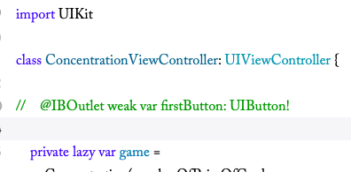
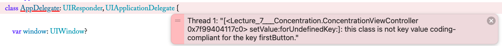
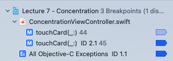
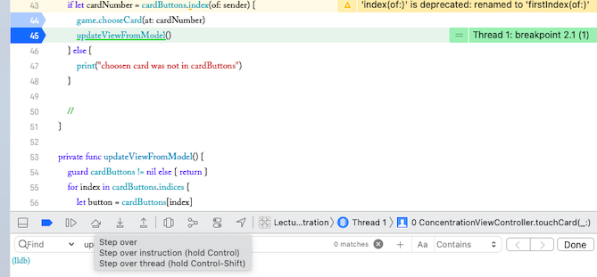
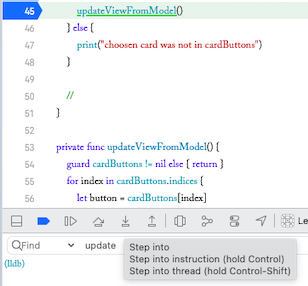
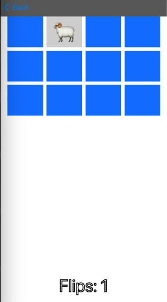
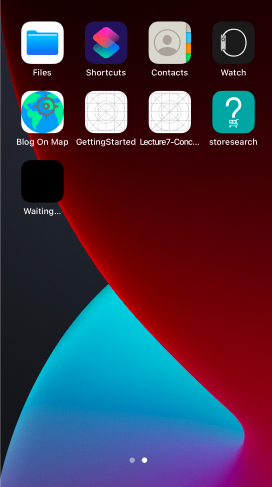
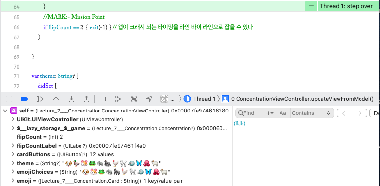
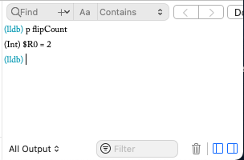

# Learn Job Seeking The Hard Way

### 1.13(수)의 퇴비💩 용 실패 기록<br>


1. TCP vs. UDP의 차이?
   
   TCP, UDP는 IP에서 통신을 할 때, 상황에 맞게 채택하는 통신 규약으로, 클라-서버 와 같은, 엔드포인트 컴퓨터끼리 데이터를 주고 받는 것에 대한
   다양한 타입의 계약 사항 중 두 가지라고 볼 수 있다. 

   TCP - __웹, 앱, 메일__ 등의 데이터 통신(비디오 스트리밍, 게임과 같이 고용량 데이터 빠른 전송이 아닌)
   * 전송할 데이터의 무결성( 유실없고, 원본 그대로 전송 )을 보장한다.
   * 무결성을 보장하기 위한, 엔드 포인트 간의 체크 단계가 많다.
     * 예시). 쓰리 웨이 핸드 셰이크 ( 3번 ACK수 !! )
        
        
        
         * SYN(CHRONIZATION)
         * SYN ACK
         * ACK
   * 단점
     * 속도가 느리다
   * 장점
     * 느리지만 유실 없는 데이터 전송을 보장한다.
     * 원본이 훼손되면 안 되는 경우 이렇게 한다.
       * 메신저 앱
       * 메일

    UDP는 유실이 발생할 수 있지만, 고용량 데이터를 빠르게 엔드 포인트 끼리 통신해야할 때 사용하는 IP 통신 프로토콜로서, 수신측과의 연결, 전송된 데이터의 무결성에 대한 체크 없이,
    데이터를 전송하는 방식이다. 3웨이 핸드쉐이크는 무슨 ?!!!... 스타 UDP를 생각하면 된다.
    * 장점
      * 빠르다...
    * 단점
      * 유실된다.
      * 깨져서 나오는 동영상 조가리들
      * 생방송의 경우 유난히 좋지 않은 화질
  
2. Race Condition, Deadlock, Dekker's Algorithm

    [유투브 참고 : Spanning Tree 채널 ❤️ ](https://www.youtube.com/watch?v=MqnpIwN7dz0)
    
    * Race Condition
      * __두 개의 스레드가 같은 자원에 동시에 접근하려 할 때( = critical zone concurrent access ), 특정 자원이 잘못 업데이트 될 수 있는 상황__. 예를 들어, 잔액에서 인출이 두 번 일어나야하는 데, 동시에 인출 작업을 하는 스레드에서, 동일 잔액에 접근하고, 한 인출의 결과만 해당 자원에 반영이 되는 경우<br>
  
    * 해결책 1 __<인디케이터를 도입하자!>__<br>
  
    
      1. 인디케이터로 레이스 컨디션이 발생하면, 누가 먼저 들어갈지 정하는 거야 !!
      2. 나라는 스레드가 임계 구역 다 처리하고 나왔으면 돌려주는 거지.. 나 진짜 .. 착하다.
      3. 그럼 다른 놈도 자기가 다 쓰고 돌려줄테고 ..<br>
    
      * 문제점 : "저기요 ... 저기요 ... 인디케이터좀 빨리 돌려놔 주세요.. 저는 여기 자주 와야 해요 .... 쫌 ..."
        
        * 한 스레드가 특정 자원에 빈번하게 접근해야할 경우 ... 자기가 쓰고 반대편으로 돌려놓은 것을 상대가 다시 접근해서 쓰고 내 쪽으로 돌려줄 때까지 기다려야한다.

    * 해결책 2 __<시그널 등을 켜는 시스템으로 바끄자!>__<br>
  
    
      1. 스레드가 임계 구역에 들어가려면, 자신의 진입 의도를 밝히는 등을 켜자 !!
      2. 단, "상대편에 등이 켜져있으면 절대로 .. 임계 구역에 들어가지 말자"라는 룰 정함
      3. 그럼 아까 말한 별로 이 구역에 자주 안 오는 사람이 인디케이터를 돌려놓지 않는 문제를 해결할 수 있지 않을까?<br><br>
    
      * 문제점 : "옴마 ... 우리가 모르고 불을 동시에 켜버렸고, **원칙2** 때문에 ... 둘 다 임계 구역에 진입해서 작업을 마치고 등을 끌 수 있는 상황이 못되네 .. 두 스레드다 이제 ... 아무 것도 진행을 할 수가 없다 ... 왜냐면 상대편 불이 꺼져야 진입하기로 했자나 ..." 
        ### "데드락" 상황

      * __해결책 : 에이 ... 바보 아냐,, 그러면 두 개를 같이 쓰면 돼지 : 인디케이터 & 시그널 등__
        1. 둘 다 켤라고 했으면, 우선 인디케이터의 방향이 향하는 스레드가 우선권을 갖는다.
           1. 그럼 우선 우선권이 없는 스레드는 자신의 등을 꺼준다. -> 배려심 ...
        2. 우선권을 가지는 스레드는 임계 구역 작업을 마치면, (배려심) 인디케이터를 다시 돌려주면서, 자신의 시그널등을 꺼준다.
        3. 그걸 보고 이제 기다리던 애는 자신의 등을 켜고, 상대편 등을 확인하면 "꺼져있네" 가자 !!
        4. 나오면 등을 끄고 돌려준다.
           1. 이때, 만약 반대편 스레드가 자주 오는 애가 아니면, 얘의 등은 아직 꺼져있는 것이다 -> 🍯 🐝 
           2. 그럼 기본 기준인 시그널 등을 먼저 켰으니 들어가면 된다.<br>
   
### 엄청 쉬운 것 처럼 말했지만, 이 2가지 신호를 동시에 쓰는 시스템을 통해, 레이스 컨디션을 해결한 알고리즘이 있었으니 ... 그는 MR.DEKKER !!


__3. View Controller Life Cycle__<br>

[참고자료 - zeddiOS](https://zeddios.tistory.com/43)

<br>

1. View Controller's view is loaded on the memory
2. viewDidload is called
3. viewWillAppear is called
4. The view of the controller is added to the view hierarchy
5. viewDidAppear is called
6. viewWillDisappear is called
7. viewDidDisappear is called
8. View Controller's view is unloaded from the memory
9. viewDidUnload is called

### 한 뷰가 생기고 그 위에 뷰가 올라갈 때


1. 1st view did load
2. 1st view will appear
3. 1st view did appear
4. 1st view will disappear
5. 2nd view did load
6. 2nd view will appear
7. 1st view will disappear
8. 2nd view did appear

### 추가된 뷰가 사라질 때


1. 2nd view will disappear
2. 1st view will appear
3. 2nd view did disappear
4. 1st view did appear

<br>
<br>
<br>

## 1.14(목) - 퇴비 💩 용 실패 기록 <br>

1. Frame & Bound의 차이?
  
   1. Frame : __Superview의 좌표계에 있어, UIView를 감쌀 수 있는 최소 크기의 사각형__ 의 좌표와 사이즈<br>
   2. Bound : UIView자체의, 좌표와 사이즈<br>
   3. 두 개의 좌표는 다른 게 자명한데, UIView의 프레임 바운드의 사이즈가 달라지는 경우는?<br>
        * 사진을 봐봐 !!<br>
          
        * 직사각형 모양의 UIView가 50도 rotate됨.
        * __frame, bound의 width엔 height가 달라질 수 있는 거야?__
          * frame : UIView를 감싸는 최소 크기의 바운딩 박스임<br>

            
          * 회전 후에 이렇게 됨
            * 이 뷰의 바운드는 여전히
              * (0,0) 180 210 로 그대로인데,
            * 그러나 프레임은 슈퍼뷰에서의,
              * __UIView를 감싸는 최소 크기의 묶음 사각형__ 의 위치와, 사이즈임
              * x:16, y:43, width : 343, height : 359로 사이즈가 매우 커졌고, 회전 이전에 비해, frame의 좌표도 달라짐.
            * 예를 들어, __UIView가 viewDidAppear 후에 애니메이션이 적용되어 회전__ 되고, 그 뷰의 프레임을 고려하여 영역이 겹치지 않게 바깥에 다른 뷰를 추가해야하는 경우, 이 개념이 적용될 수 있을 것이다.
  
2. 멀티 스레딩 상황에서 공유되는 자원에 대한 동기화 처리? (해당 자원에 대한 동기화 처리)<br>
   <br>
    [참고](https://medium.com/swiftcairo/avoiding-race-conditions-in-swift-9ccef0ec0b26)
    * 임계 구역을 정하고 -> 임계 구역에 진입했을 때, 먼저 진입한 쓰레드가 lock.lock()을 건다. 그리고, 임계 구역에 대한 실행이 끝났을 때에 한해, lock.unlock()을 한다.
      * 문제점 : 데드락이 발생할 수 있다.
        * 예를 들어 스레드 1에서는 열쇠1을 들어, 임계 구역1을 잠궈두었고, 스레드 2는 열쇠2를 들어, 임계 구역 2를 잠궈 두었는데, 스레드1에서 진행하고 있는 작업이 마무리 되기 위해, 임계 구역 2에 진입해야 하고 열쇠2가 필요하고, 스레드2의 작업을 끝내기 위해 스레드 1에 진입해야하고 열쇠 1이 필요하다면, 서로가 작업을 끝내고 열쇠를 내려놓을 수 있을 자원을 서로가 들고 있기 때문에, 영원히, 진행되지 못하게 되는 __데드락__ 이 발생할 수 있다.
        * 임계 구역에 락, 언락을 거는 것은 **데드락** 에 주의하여 사용해야한다.
    * 임계 구역에 해당하는 작업은!! __Serial Dispatch Queue에서 Serially Schedule__ 한다. 스레드1 스레드2에서 여러 블록을 멀티태스킹하다가, 임계 구역에 해당하는 작업을 DispatchQueue - Serial에 스케쥴링하면, 선후 관계가 생겨, 임계 구역에 진입하는 작업에 있어 순차적으로 진행될 수 있다.  
  

   <br>
3. GCD에서 일련의 작업이 백그라운드큐에서 concurrently가 아닌 serially 처리되도록 만들려면?<br> 
  <br>
  [스탠포드 iOS 강의 참고](https://www.youtube.com/watch?v=jDYp9toF_7A&t=2066s)<br>
  [zeddiOS 참고](https://zeddios.tistory.com/516)
  <br>
     * main(UI, serial)큐는 코드 블록들을 시리얼하게 처리하지만, 유아이 작업 외의 블락 가능성이 있는 작업을 디스패치 하면 안 된다.반면, global(non-UI, concurrent)는 일련의 코드 블록들을 이전 작업의 완료 여부와 관계없이 가용한 쓰레드에서 진행시켜 버려, 각 블록의 완료 순서에 대한 컨트롤이 없다. 만약, 일련의 작업이 선후관계를 가져야하고, 의존성이 있다면 문제가 생긴다.
    * __메인 큐__ 가 아닌 큐에서 멀티스레딩을 하면서, 일련의 블록들을 __serially dispatch__ 하고 싶으면, __"serial한 큐를 직접 인스턴스화 하여"__ 사용하면 된다.<br><br>
    * [출처](https://zeddios.tistory.com/516)<br>
    
    example code
    <br> 

    ``` swift

    let zeddQueue = DispatchQueue(label: "zedd")
    zeddQueue.async {
      for i in 1...5 {
        print("\(i)🐶")
      }
        print("==================")
      }
    zeddQueue.async {
      for i in 200...205 {
       print("\(i)😍")
      }
        print("==================")
      }
      for i in 100...105 {
        print("\(i)👻")
      }

    ```
    <br>
    <br>

4.  __iOS 개발시 디버깅 어떻게 함? 🏋🏻‍♀️🔥__ <br>
    [스탠포드 cs193p 강좌 session 참고](https://www.youtube.com/watch?v=-UtIg4Lt7T8&t=319s)
    
    1. __콘솔에 나온 에러 메시지를 통해서, 에러의 종류 및 description을 통해 디버깅 하는 경우.__
       1. 의도적으로 스토리 보드에 있는 컨트롤에서 연결될 변수를 뷰 컨트롤러에서 삭제해 봄
        
        <br>
        
        
        <br>
        
        * 2021-01-15 19:05:01.166738+0900 Lecture 7 - Concentration[8614:389693] *** Terminating app due to uncaught exception __'NSUnknownKeyException'__, reason: '[<Lecture_7___Concentration.ConcentrationViewController 0x7f99404117c0> setValue:forUndefinedKey:]: this class is not key value coding-compliant for the key firstButton.'
    *** First throw call stack: ~~<br>

        1. 메세지에서 __firstButton__ 이라는 요소와 키-발류 매칭에 문제가 생겼다는 수준으로 파악 가능<br><br>
    1. __에러가 난 부분을 정밀하게 파헤칠 __브레이크 포인트__ 설정법__<br>
   
       
       1. 브레이크 포인트를 특정 라인에 설치해 둔다.
          1. 그러면 코드가 실행되다가 그 포인트에서 멈추어, 지정한 곳 부터 라인 바이 라인으로 실행된다.
       2. 라인이 아니라,Exception이 발생한 시점으로 설정할 수도 있다. __ 다양한 타이밍에 멈출 수 있다. __
          1. 그러면, __콘솔창에 에러 메세지를 던지지 않고, 그저 objc exception 객체를 던진 파트에서 멈춘다__. 
       3. 의심 지역에 브레이크 포인트를 잘 설정했다면, 멈춘 후에, 그때 부터 라인 바이 라인으로 step(한 걸음씩 내딛기) 한다. 
         <br><br>

            * 서브 루틴을 만나면, 그 서브 루틴으로 step into 하여 라인 바이 라인 할 수 있다.  
        <br>

         
        <br><br>

          시뮬레이터를 지켜보면서, 어떤 라인에서 앱이 크래시 하여 꺼지는 지 파악한다.

        <br>

       * 현재 카운트 2에서 크래시 되도록 설정한 상황<br>
              
             <br>
              
            * 크래시 한다 !! 
              <br>
            
            * 이 라인에서 ...
                <br><br>
                  
                  <br>
                * 멈춰 버린 것이다.<br><br>
                  
                  <br>
              
              * 흠 .. 일단 플립 카운트가 2면 크래시 하라고 내가 했었네 ?.. 지금 플립 카운트를 확인한다 !!
                * XCODE는 각 타이밍 마다 "Memory Hierarhcy"로 각 변수들이 현재 어떤 값, 객체가 저장되어 있는지 알려준다.
                * 크래시 하기 직전, 플립 카운트 변수는 2였던 것이다 ..<br> 
                
                * 옆에 디버깅 창에 각 객체와 변수를 프린트해서 상태를 아주 상세하게 볼 수 있다.
                  * po - (print object), p - (print in human readable form)
                  * "p flipCount"를 해보자<br><br>
                    
                    * 현재 0번 레지스터에 2로 저장되어 있다.
                    * 그렇다면, 다음 라인의 if flipcount == 2 { exit(-1) }을 만나기 때문에,
                    * 바로 ,,, 그,,, 그래서,,, 앱이 꺼지던 거였던 것이다.

    2. 결론, 
       1. 콘솔창에서 메세지를 주면, Exception, Error 메세지, 해당하는 변수에 대하여 알려줘서 그걸로 해결할 수 있다면 -> 아주 좋다. BUT,
       2. 정확히 어떤 라인에서, 어떤 상황에서 깨지는 지 알아야 해결이 가능한, 나같은 사람은,,,
          1. Exception에 대하여 브레이크 포인트 설정
          2. 의심가는 Dangerous Section에 브레이크 포인트 설정 후
             1. Step By Step 진행해가며, <-> 시뮬레이터도 동시 참고
             2. 앱이 크래시 되는 라인을 파악하고
             3. 크래시되기 직전에 여러 변수들의 상태를 Memory Hierarchy 와 lldb 창에 p -, po - 명령어를 통해서 정확히 확인하며, 앱이 크래시한 원인을 파악하면 된다.

    3. 훈훈한 결론 +
       1. 공부하기 전에는 너무 어려워 보여서 피한 것들이, 막상 알고보면, 상식적인 단계가 결합되어 있는 것에 불과하고, 그저 시간을 들여서 공부해내면 되는 경우가 많은 것 같다.
       2. " 닝겐은 쉽게 좌절하지만, 보통 근거 없는 좌절감에 불과한 경우가 많다. "
       3. 스탠포드 iOS 수업 짱 ... 보물과도 같다 ... 꼭 들어봐야지 !!<br><br>

5. struct vs. class 차이<br><br>
   1. class pass by reference<br>
      * gives pointer when passed<br>
      * refering to the same instance<br>
      * (+) inheritance is possible<br>
   2. struct pass by value<br>
      * copied when passed<br><br>

6. ⭐️⭐️ Observable Object를 직접 구현한다면 ? 어떻게 옵저버 패턴을 구현할 것인가 ⭐️⭐️ <br>
   <br>

[참고 - 옵저버 패턴 구현 - 스위프트](https://linsaeng.tistory.com/6)<br><br>

   ```swift
  
  //옵저버들이 어떻게 업데이트할 지, 프로토콜, 새로운 속성값을 받는 업데이트 메서드 정의
  protocol Observer {
    func update(_ notifyValue: Int) 
  }

   class Subject {

    private var observers: [Observer] = [Observer]() // 옵저버들은 피-관찰 객체의 옵저버 리스트에 등록
    private var value: Int = Int()

    //해당 객체에 대하여 관찰하고자 하는 속성 프로퍼티의 -> 세터에, notify()를 호출해준다.
    var number: Int {
        set {
            value = number
            notify()
        }
        get {
            return value 
        }
    }

    //옵저버를 객체의 옵저버 리스트에 더해주는 함수
    func attachObserver(_ observer: Observer) {
        observers.append(observer)
    }
    
    //옵저버 알림 - 속성에 새로운 값이 셋 되었을 때, 옵저버로서 프로토콜을 채택한 관찰자 님들의 update함수를 바뀐 속성과 함께 호출해주는 -> 노티파이!!
    func notify() {
        for observer in observers {
            observer.update(number)
        }
    }
}
```

7. __테이블뷰 오토매틱 셀 하이트 설정 어떻게 하는가?__
8. __요즘 램 용량도 큰데, 군디 메모리 최적화를 하는 이유는?__


### < 1.14(목) 퇴비용💩 실패 기록> 을 마무리하며,,, 이 링크를 미래의 유저가 흡족하게 내 앱을 사용하는 장면을 상상하면서, 공부 🙇🏻‍♂️ 👨🏻‍💻 합시다.

  * [디자인 패턴](https://linsaeng.tistory.com/category/Swift/%EB%94%94%EC%9E%90%EC%9D%B8%ED%8C%A8%ED%84%B4)<br>
  


