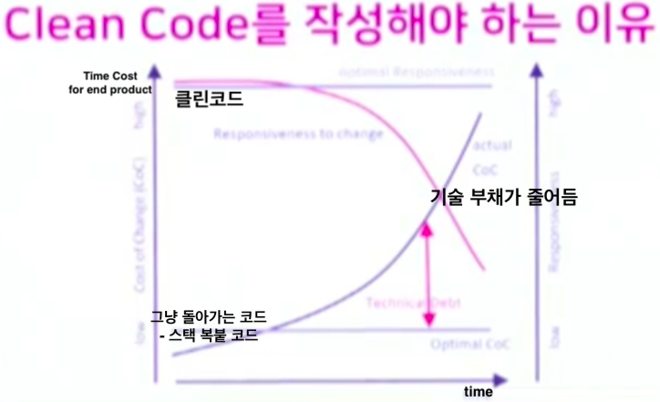

## Clean Code

> Readability(가독성) & short

1. 왜 ? 클린 코드를 써야하는 건데? 😳  
    __장기적으로 유지 * 보수 * 테스트 * 확장에 효율적인 코드를 작성하기 위해서.__
 

### 기술 부채를 줄이기 위해 고려할 요소들
* 같이 개발하는 팀원들이 이해하기 쉽도록 작성된 코드
  
  1. Naming - 길어도 의미가 확실한 변수명
  2. Style - 행간 분리, 들여쓰기 깔끔하게
  3. Comment 주석 - 좋은 코드를 썼다는 가정하에 + 좋은 코드로 나타낼 수 없는 것을 주석으로
  4. Catch Dead Code - 데드 코드 정리
  5. Method Parameters - 메서드 - 인수 갯수 - 3개 이하로 유지(컨벤션)
  6. Same feature, Keep it short - 짧고 단순함을 지향
  7. Method function only one - (서버)메서드 하나 당 단일 기능을 유지하기 - 유지 보수에 편함
  8. _